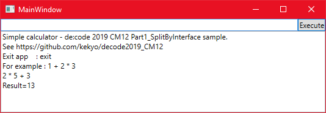
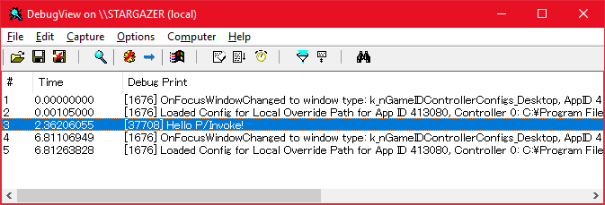
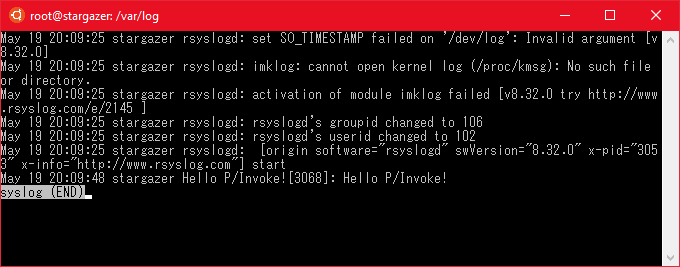

# de:code 2019 CM12 - Interoperability of .NET assemblies.


このリポジトリは、2019年5月に東京で開催される[「de:code 2019」](https://www.microsoft.com/ja-jp/events/decode/2019/default.aspx)のセッション[「CM12: .NET Core マルチプラットフォームの本質」](https://www.microsoft.com/ja-jp/events/decode/2019session/detail.aspx?sid=CM12)に対応するサンプルコードと解説を公開しています。

* (作業中です)

* 本記事はKouji Matsuiが独自に構成、執筆したものであり、[「Microsoft MVPパーソナルスポンサー」](https://www.microsoft.com/ja-jp/events/decode/2019/sponsor.aspx)として提供するものです。de:code 2019のオフィシャルドキュメントではありません。
* 本記事執筆時には、セッションの概要のみ公開されているため、内容が密接に連携しない場合があります。また、内容は、原稿執筆時の情報によります。
* ライセンスは外部参照を除き、MITとします。コードにはいかなる保証もありません。ご自身のプロジェクトに適用する場合は、各自の判断で行ってください。
* サンプルコードの開発検証環境は、Visual Studio 2017 (15.9.11)です。2019でも動作すると思われますが、都合により未確認です。また、Linux環境はWSL1のUbuntu 18.04 + dotnet-sdk-2.2 (2.2.204-1)で検証しました。

# 概要

.NETにおけるマルチプラットフォーム対応を支えるための、アセンブリレベルでの互換性の対処方法について、サンプルコードと解説を行います。章が進むにつれて、より細部についての解説を行っています。

* マネージドサイド
  * インターフェイス分離
  * Bait and switchテクニック
* アンマネージ連携
  * P/Invoke
  * ガベージコレクションの影響
* ランタイムサイド
  * System.Private.CoreLib
  * FCall
  * QCall

# マネージドサイド

マルチプラットフォーム戦略で最も一般的に使用されるテクニックは、インターフェイス分離と依存注入(Dependency Injection)でしょう。この項では、インターフェイス分離と、それに似たもう一つのテクニックについて解説します。

## インターフェイス分離

インターフェイス分離は最も基本的なテクニックです。.NETのインターフェイス型を使用して、異なる実装の詳細を、同一の(広義の)インターフェイスで分離する事により、それぞれをマルチプラットフォームに対応した処理として共通に扱えるようにします。

[SeparatesByInterfaceTypeプロジェクト](Part1_SeparatesByInterfaceType)は、以下の機能を持ちます:

* 複数の値を入力すると、計算結果が出力される。
* 入出力の対象は、コンソール(コマンドライン)と、GUI(WPF)である。

計算を司る共通のライブラリ「Calculator.Core.dll」と、それらを使用する各アプリケーションをインターフェイス定義で分離します。

コンソールアプリケーションの場合:


GUIアプリケーションの場合:


この図のように、右側の計算ライブラリには、プラットフォーム固有の実装は全く含まれず、左側のアプリケーション側に固有の実装を用意しておき、インターフェイス定義経由で計算ライブラリから操作できるようにします。

ConsoleCalculatorの実行結果:


WpfCalculatorの実行結果:



ここでは依存注入を、手動での注入(メソッド引数で直接注入する)を行っています(より発展した例としては、MEFや各種依存注入ライブラリを併用することが考えられますが、ここでは割愛します)。このサンプルコードで重要な点を以下に挙げます:

* 計算を実行する本体(Calculator.Core)ライブラリは、プラットフォーム中立であり、netstandard2.0としてビルドしている。
* Calculatorライブラリには、コンソールやGUIへの入出力コードは一切含まれておらず、それぞれ独立したアセンブリ(ConsoleCalculator, WpfCalculator)にのみ含まれる。
* 同じ手法を用いて、その他のプラットフォームにも移植できる。その際、計算ライブラリに手を入れる必要がない。

## Bait and switchテクニック

このテクニックは、以下のような二種類のアセンブリを用意しておき、コードのビルド時と実行時で異なるアセンブリを使用することです:

|アセンブリ|内容|
|:---|:---|
|ビルド時用|ビルドに使用するためだけのアセンブリ（「参照アセンブリ」と呼ぶ）。アセンブリ内の実装コードは、まったく存在しないか部分的にか存在しない。コンパイラが、型のメタデータ定義(クラス名やメソッド名、引数群など)さえ確認できれば良い|
|実行時用|実行時に使用するアセンブリ。それぞれのプラットフォームに応じたアセンブリ(但し、インターフェイス定義は上記と同一)を用意する。当然、アセンブリ内部の実装はそれぞれのプラットフォームによって異なる|

例えば、.NET標準のアセンブリとして「System.Runtime.dll」があります。ビルド時に参照するこのアセンブリは、実は内部に実装が存在しません。しかし、メタデータ定義は正常であるため、ビルド自体は成功します。その結果、アプリケーション内部には、System.Runtime.dllを使用している、という参照情報だけが残ります。

次に、アプリケーションを実行環境に移して実行すると、そのときに使用されるSystem.Runtime.dllは、実行環境に存在する「別の」System.Runtime.dllが使用されます(Windowsの場合、GACに配置されています)。このアセンブリにはプラットフォーム環境に依存した実装が入っていますが、メタデータ定義は同一であり、アセンブリローダーはエラーとならずロード出来るため、実行できます。


もちろん、参照アセンブリと異なるメタデータを持っていた場合(例えば、とあるクラスのメソッドの引数の型が違っているなど)は、実行時に[MissingMethodException](https://docs.microsoft.com/ja-jp/dotnet/api/system.missingmethodexception)などの例外が発生する可能性があります。

[BaitAndSwitchプロジェクト](Part2_BaitAndSwitch)は、最初の計算アプリケーションをBait and switchテクニックを使って実装したものです:

* 参照アセンブリとして、[Host.Referenceプロジェクト](Part2_BaitAndSwitch/Host.Reference/Interaction.cs)を用意する。実装は空で、クラスとメソッドが定義されているだけである。
* 上記参照アセンブリの定義と同一だが、それぞれコンソールとWPFに対応する実装を含んだ、[Host.Consoleプロジェクト](Part2_BaitAndSwitch/Host.Console/Interaction.cs)と[Host.Wpfプロジェクト](Part2_BaitAndSwitch/Host.Wpf/Interaction.cs)を用意する(アセンブリのファイル名はすべて同一で、Host.Core.dll)。
* 他のアセンブリはすべて共通で、アプリケーション実行前にHost.RefereceをHost.ConsoleまたはHost.Wpfに入れ替える。
  * Console.batから起動すると、Host.Consoleに置き換えて実行する。
  * Wpf.batから起動すると、Host.Wpfに置き換えて実行する。
  * 置き換えずに実行すると、Host.Referenceを使うことになるため、実行時例外が発生する。

Bait and switchテクニックは、インターフェイス分離とよく似ています。しかし、インターフェイス分離の場合は、設計者が適切に分離設計をする必要があります。Bait and switchは、CLRがアセンブリを同一視する方法に乗じて、コードに全く手を入れずに、プラットフォーム依存処理を入れ替えることを可能にします。これは、.NET FrameworkがPC環境を超えてマルチプラットフォーム展開するために、互換性を維持しながら、(アプリケーションのコードを変更する事なく)異なる環境で動作させるための手段とも考えられます。

以下にこの2つの分離手法を比較した表を示します:

|手法|メリット|デメリット|
|:---|:---|:---|
|インターフェイス分離|誰でもリスクなしで使用できる|初めから使用する前提で設計する必要がある|
|Bait and switch|後から依存性の分離を行うことができる|メタデータの不一致による障害がコントロールしにくいため慎重を要する|

かつてのPortable Class Libraryは、Bait and switch手法で互換性を実現しました。ここまでの解説で、PCLが何十というプロファイルを持っていたことを考えると、問題が発生しないように保守することがいかに困難であったかが想像出来ます。

# アンマネージ連携

P/Invokeは.NETのアンマネージドコード連携の手段の一つです。もう一つはCOM連携ですが、本稿では割愛します。

## P/Invoke

P/InvokeはCLRに組み込まれている、ネイティブコードライブラリとの連携機能です。また、C#などの.NETコードからこれを簡単に利用できるようにしています。例えば、以下のコードは、C#から直にWin32 APIを呼び出します:

```csharp
public static class Program
{
    // Win32デバッグメッセージ出力API
    [DllImport("kernel32.dll", CharSet=CharSet.Unicode)]
    private static extern void OutputDebugString(string lpOutputString);

    public static void Main(string[] args) =>
        OutputDebugString("Hello P/Invoke!");
}
```

ネイティブコードのライブラリがダイナミックリンクライブラリとして用意されていれば、全く同じ手法でコードを記述することが出来ます。LinuxやMacOSといったプラットフォーム向けのコードは、それぞれで要求されるネイティブコードライブラリが異なることが多々ありますが、P/Invokeの使用方法は同じです。.NET Coreやmono向けのライブラリも、同じように作ることができます。

前節で述べた、インターフェイス分離設計やBait and switchテクニックをP/Invokeと組み合わせると、.NETでマルチプラットフォームの一貫したライブラリ設計を行うことができます。つまり、前節の依存コードの部分をP/Invokeを使って実装すれば、そのプラットフォーム固有のAPIがネイティブコードであったとしても、共通のインターフェイス型や共通のメタデータを持つBait and switch用アセンブリを構築することで、プラットフォーム依存を分離することができます。

[PInvokeプロジェクト](Part3_PInvoke)は、これまでの説明を踏まえた、マルチプラットフォームアプリケーションです:

* Bait and switchテクニックで、WindowsとLinux環境を切り替える。
* コマンドライン引数に指定した文字列が、デバッグメッセージとしてシステムに送信される。
* デバッグメッセージは以下のように処理される:
  * Windows環境の場合、Win32のOutputDebugString APIを使用して出力する。これは[SysinternalsのDebugViewユーティリティ](https://docs.microsoft.com/en-us/sysinternals/downloads/debugview)で確認できるほか、各種デバッガがアタッチされていれば、デバッガ上で確認できる。
  * Linux環境の場合、syslog APIを使用して出力する。

注意: この程度の規模であれば、Bait and switchテクニックを使用する理由は全くありません。ここでは、後述のランタイムサイドに話をつなげるため、あえてBait and switchで実装を行っています。

DebugMessageプロジェクトは、DebugMessage.Referenceの参照アセンブリを使ってビルドします。実際に必要なのは、それぞれの環境のアセンブリDebugMessage.Win32とDebugMessage.Linuxです。前節のサンプルと同じく、これらを実行時に置き換える必要があります。

以下はWindows環境でWin32.batを実行したときの、DebugViewユーティリティの出力です:



以下はWSL1のUbunt 18.04環境でlinux.shを実行したときの、`/var/log/syslog`の出力です (あらかじめ`service rsyslog start`でrsyslogを動かしておく必要があります):



## ガベージコレクションの影響

P/Invokeを初めて使う場合、ネイティブコード実行中の.NETインスタンスがどのように扱われるのか、疑問に思う方も居ると思います。具体的には、.NETで生成したインスタンスをP/Invokeを通じて渡した場合、ガベージコレクタが意図せず回収してしまうことは無いのか、という点です。

例えば、以下の疑似コード:

```csharp
// foo.dll内のReadToBuffer APIを呼び出す
// extern "C" void ReadToBuffer(uint8_t* pBuffer, int32_t size);
[DllImport("foo.dll")]
private static extern void ReadToBuffer(byte[] buffer, int size);

public void Read()
{
    var buffer = new byte[100];

    // byte配列は自動的にマーシャリングされる。
    // API呼び出し中にbufferがGCによって回収されることは無いのか？
    ReadToBuffer(buffer, buffer.Length);

    // (A)
}
```

ガベージコレクタは、引数・ローカル変数・フィールドなどからインスタンスが参照されているかどうかを追跡しています。このような状況では、bufferのインスタンスが回収されてしまうことはありません。APIが実行を終えて戻ってきたとき(A)、bufferにアクセス出来ることを期待するのは自然なことです。

[GCHandle構造体](https://docs.microsoft.com/ja-jp/dotnet/api/system.runtime.interopservices.gchandle)を使用すると、インスタンスへの生のポインタを取得できます。例えば:

```csharp
// foo.dll内のReadToBuffer APIを呼び出す
// extern "C" void ReadToBuffer(uint8_t* pBuffer, int32_t size);
[DllImport("foo.dll")]
private static extern void ReadToBuffer(IntPtr buffer, int size);

public void Read()
{
    var buffer = new byte[100];

    // GCHandleを使って生のポインタを得る(手動マーシャリング)
    // 生のポインタを得るには、アドレスが固定されなければならない(Pinned)
    var bufferHandle = GCHandle.Alloc(buffer, GCHandleType.Pinned);
    var pBuffer = bufferHandle.AddrOfPinnedObject();

    try
    {
        // pBufferは配列の先頭を示す、本物のアドレス
        ReadToBuffer(pBuffer, buffer.Length);
    }
    finally
    {
        // 不要になったら解放する必要がある。解放しなかった場合はメモリリークする。
        bufferHandle.Free();
    }
}
```

このコードは、先程の例とほぼ同じです。P/Invoke呼び出しのためのポインタへのマーシャリングを自動で行うか、手動で行うかの違いです。

|手法|メリット|デメリット|
|:---|:---|:---|
|自動|安全で簡潔に記述できる|マーシャリングのタイミングをコントロールできないため、パフォーマンスの問題につながることがある|
|手動|マーシャリングのタイミングをコントロールできるため、パフォーマンスを最大化出来る|ガベージコレクタに誤って解放されたり、メモリリークしないように注意を払う必要がある|

例えばバッファへのポインタが頻繁に必要になる場合、自動マーシャリングするよりも、一度だけ手動マーシャリングして連続してポインタを使用し、最後に手動で解放したほうが効率的かもしれません。

[Marshalingプロジェクト](Part4_Marshaling)は、実際に動作するマーシャリング処理の例です:

* このプロジェクトは、[GCHandle.Allocメソッドの例](https://docs.microsoft.com/ja-jp/dotnet/api/system.runtime.interopservices.gchandle.alloc)を再構成したものです。
* EnumWindows APIを使用して、すべてのウインドウのタイトル文字列を列挙します。
* 自動マーシャリングと手動マーシャリングの例を示します。

以下に、マネージド環境とアンマネージ環境との境界を行き来する際に、暗黙または意図して注意する必要のある事項をまとめます:

* マーシャリングを自動で行うのか、手動で行うのか、及びパフォーマンスへの影響。
* ガベージコレクタによって意図せずインスタンスが解放されないようにする、あるいは正しく解放されるようにする。

# ランタイムサイド

ここまでは、一般の開発者がマルチプラットフォーム対応アプリケーションを設計する場合において考慮すべき点を、如何に依存コードを分離して実現するか、という視点で解説しました。

この節では、.NET自身が、マルチプラットフォーム対応するためにどのような道具を使用しているのかを述べます。つまり、.NET Coreにおいて、coreclrやcorefxがどのようにマルチプラットフォームを実現しているのかという点に注目します。

基本的に、今まで述べてきたテクニックが利用できる部分では、そのまま利用できます。例えば、

TODO:

## System.Private.CoreLib

TODO:

## FCall

TODO:

## QCall

TODO:
